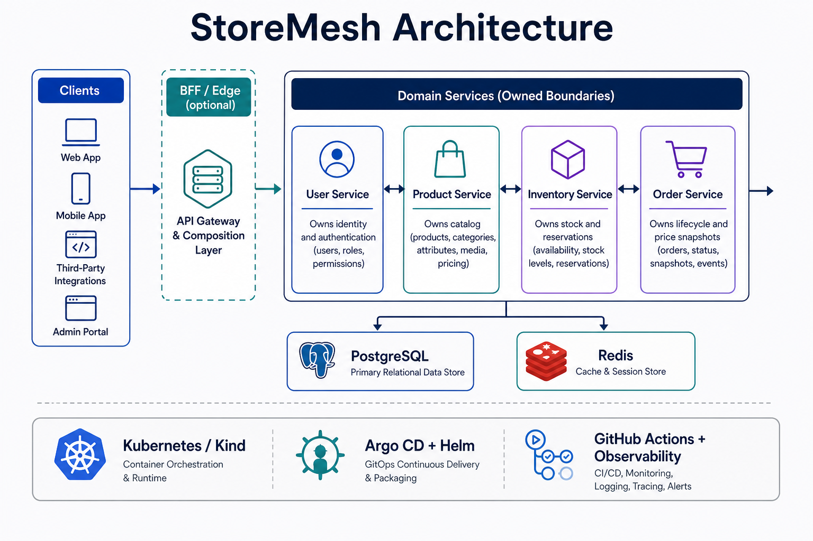

# Architecture

## Service and transport boundaries

Each StoreMesh domain service owns its business logic, persistence integration,
and public contracts. Transport handlers are adapters around one domain service
instead of separate implementations of business rules.



The diagram is an overview; the repository and roadmap pages remain the source
of truth for implementation status and deployment evidence.

| Boundary | Current approach |
| --- | --- |
| Internal APIs | gRPC |
| Direct HTTP APIs | Gin handlers owned by each service |
| Contracts | Protocol Buffers, HTTP annotations, generated OpenAPI |
| Authentication | JWT access and refresh tokens, Redis-backed sessions |
| Authorization | Persisted user roles and server-side role checks |
| Observability | OpenTelemetry traces, Prometheus metrics, structured logs |

## User service

The user service is the current reference implementation. It exposes gRPC on
port `50051` and HTTP on port `8080`. Both transports invoke the same domain
service. Its HTTP endpoints include authentication, user management, role
operations, liveness (`/healthz`), readiness (`/readyz`), and metrics
(`/metrics`).

## Platform delivery flow

```text
Service source → CI/security checks → container image → Helm chart
       → Argo CD application → Kubernetes cluster
```

Helm owns Kubernetes workload configuration. Argo CD continuously reconciles
the desired state from Git. Kind is the local, repeatable platform target.

## API composition and BFF decision

API composition is expected for richer client workflows, but it is not a
requirement for every service call. A client can call a single domain service
directly when that service owns the complete use case. A composed experience
such as an order summary may eventually need Product, Inventory, Order, and
User data combined into one client-oriented response.

A future BFF would be an optional edge service for that composition. Its
external protocol may be REST, GraphQL, or both, while its internal calls would
normally use the domain services' gRPC contracts:

```text
Web/mobile client → BFF REST or GraphQL API → internal gRPC → domain services
```

REST and GraphQL are alternatives for the BFF's client-facing API, not
mandatory requirements to introduce together. GraphQL is useful when clients
need flexible, nested selection; REST is simpler when resource-oriented
endpoints and HTTP caching are sufficient. The BFF could be implemented in
Node.js/TypeScript, Go, or another supported platform; the language does not
change the boundary rules.

The BFF remains deferred until client journeys show measurable value from
aggregation, client-specific response shaping, edge authentication, rate
limiting, or routing. It must remain an orchestration and presentation layer
and must not absorb Product, Inventory, Order, or User business ownership.

## Product service

The Product Service is the first commerce-domain boundary after identity. It
owns catalog identity, SKU, pricing, currency, and product lifecycle state. It
does not own inventory availability, cart state, orders, payments, or users.
Its initial protobuf contract is published in the
[`storemesh-product-service`](https://github.com/sartim/storemesh-product-service)
repository as the boundary for the upcoming catalog runtime.
The repository now includes reproducible generated gRPC, HTTP gateway, and
OpenAPI artifacts from its Buf template, plus an in-memory gRPC runtime for
contract and behavior validation. Product Service now supports a PostgreSQL
repository selected by
`DATABASE_URL` and JWT authorization when `JWT_SECRET` is configured; its
schema is tracked in `migrations/001_products.sql`.

## Inventory service

The Inventory Service owns on-hand, reserved, and available quantities plus
reservation lifecycle. Product Service remains the source of product identity;
orders will coordinate inventory operations through this service boundary.
The initial contract is published in the
[`storemesh-inventory-service`](https://github.com/sartim/storemesh-inventory-service)
repository, which now includes an in-memory runtime enforcing reservation and
oversell-prevention semantics. Its PostgreSQL schema foundation is tracked in
`migrations/001_inventory.sql`, with transactional repository operations for
adjustment, reservation, and release.

## Order service

The Order Service owns order lifecycle, customer association, line-item price
snapshots, totals, and cancellation. It coordinates Product and Inventory
through their public contracts and does not directly own catalog or stock
records. Its initial contract is published in the
[`storemesh-order-service`](https://github.com/sartim/storemesh-order-service)
repository.

The initial runtime validates line quantities, calculates immutable order
totals from price snapshots, and supports cancellation transitions.
Its PostgreSQL schema foundation is tracked in `migrations/001_orders.sql`, and
the runtime now switches to a transactional PostgreSQL repository when
`DATABASE_URL` is configured. Order creation persists the order and all line
items atomically; reads reload immutable price snapshots and cancellation is a
guarded state transition.
The service also has a distroless multi-platform container workflow and is
packaged for GitOps through the Order Service Helm chart and Argo CD
application.

## Documentation platform evolution

The current documentation site uses Jekyll and Markdown on GitHub Pages. A
future Next.js static-export site is reserved as an option for interactive
architecture views, richer search, API explorers, or versioned documentation.
It should be reconsidered after the API contracts and domain-service surface
have matured; it is not a current runtime dependency.
