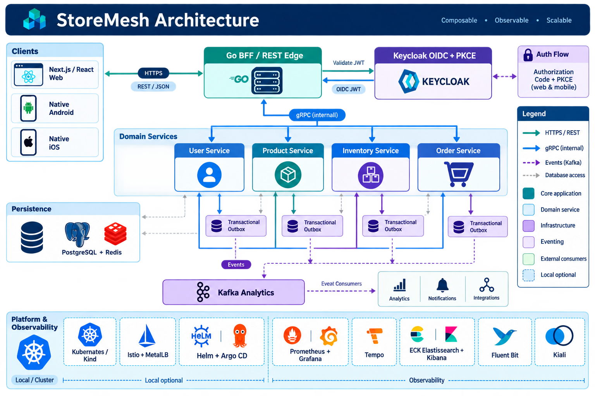
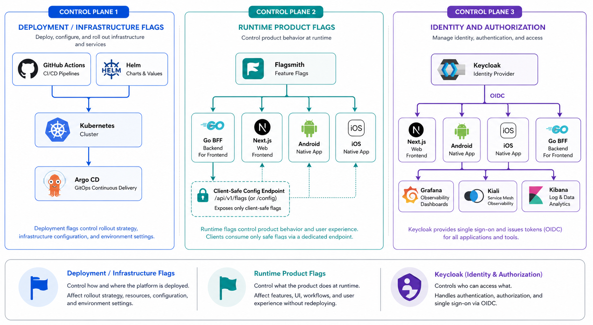

# Architecture

## Service and transport boundaries

Each StoreMesh domain service owns its business logic, persistence integration,
and public contracts. Transport handlers are adapters around one domain service
instead of separate implementations of business rules.



The diagram is an overview; the repository and roadmap pages remain the source
of truth for implementation status and deployment evidence.

| Boundary | Current approach |
| --- | --- |
| Internal APIs | gRPC |
| Direct HTTP APIs | Gin handlers owned by each service |
| Contracts | Protocol Buffers, HTTP annotations, generated OpenAPI |
| Authentication | Keycloak OIDC; Authorization Code + PKCE for web and native clients |
| Authorization | Validated OIDC claims and mapped Keycloak roles; User Service owns customer profiles |
| Observability | Prometheus, Grafana, Alertmanager, Tempo, plus optional Elasticsearch/Kibana logging |

## Observability architecture

Observability is a platform capability rather than a responsibility duplicated
inside each domain service. Services emit structured JSON logs, Prometheus
metrics, and W3C/OTLP trace context; the platform collects and correlates those
signals:

```text
Services ── metrics ───────────────► Prometheus ─► Grafana/Alertmanager
         ── JSON logs ─► Fluent Bit ► Elasticsearch (ECK) ► Kibana
         ── OTLP traces ───────────► OpenTelemetry Collector ► Grafana Tempo
Istio ──── access metrics/traces ───► Prometheus/OTel (with Kiali as an optional view)
```

Prometheus, Grafana, and Alertmanager are the initial metrics and alerting
stack. Elasticsearch and Kibana, managed by the Elastic Cloud on Kubernetes
(ECK) operator, are the selected centralized logging path, with Fluent Bit (or
an equivalent node collector) forwarding logs and applying retention and
redaction policy. Istio is an optional service-mesh layer for
traffic policy, mTLS, access telemetry, and uniform tracing. It can manage the
current internal gRPC boundaries because gRPC uses HTTP/2, including service
discovery, mTLS, traffic shifting, timeout/retry policy, and mesh telemetry.
It is not required for those boundaries: services can communicate directly over
ClusterIP gRPC with their existing contracts and NetworkPolicies. In this
project, the local deployment path does support Istio for those gRPC calls:
the Argo CD applications enroll the service namespaces, inject sidecars, and
apply `PERMISSIVE` mTLS during migration. Therefore “optional” describes
whether an environment must install Istio, not whether Istio can be used when
it is installed. OpenTelemetry Collector is preferred
as the stable ingestion boundary so the trace backend can be changed without
modifying services.

These components are installed in stages through Argo CD and remain opt-in for
the local Kind profile. Production environments must define persistent storage,
resource limits, retention, access control, and secret management before
enabling Elasticsearch or a mesh. Application `PrometheusRule` resources are
enabled only after a Prometheus Operator-compatible stack is available.

## Recommended transport architecture

StoreMesh uses protobuf and gRPC as the canonical service contract. The Go BFF
is the client-facing edge: REST/JSON serves resource-oriented and operational
requests, while GraphQL is the API-composition surface for views that span
domains. This gives internal service calls strong typing, streaming support,
deadlines, and consistent status semantics without forcing web and mobile
clients to speak gRPC.

The target shape is:

```text
Web / mobile / partner clients
             │ REST/JSON or GraphQL over HTTPS
             ▼
       Go BFF / edge API
             │ gRPC + protobuf
             ▼
 User ─── Product ─── Inventory ─── Order
```

The Go BFF should use generated gRPC clients and, where practical, generated
gRPC-Gateway bindings for straightforward REST-to-gRPC translation. GraphQL
resolvers should be reserved for true composition, such as an order summary
that combines order, product, inventory, and user data. Domain services should
not each grow separate public REST or GraphQL implementations for the same
business operations.

During the transition, existing service-owned REST endpoints may remain for
authentication, health, readiness, metrics, and compatibility. New client
business workflows should converge on the BFF, while service-to-service
traffic remains gRPC. REST should not be used for internal orchestration unless
there is a clear external integration requirement.

This decision avoids maintaining two independent business APIs per service and
keeps composition in one edge boundary. REST and GraphQL are complementary:
REST is simpler for stable resources and HTTP caching, while GraphQL prevents
client-specific composition endpoints from multiplying as screens need data
from several domains.

## User service

The user service is the current reference implementation. It exposes gRPC on
port `50051` and HTTP on port `8080`. Both transports invoke the same domain
service. Its HTTP endpoints include authentication, user management, role
operations, liveness (`/healthz`), readiness (`/readyz`), and metrics
(`/metrics`).

## Platform delivery flow

```text
Service source → CI/security checks → container image → Helm chart
       → Argo CD application → Kubernetes cluster
```

Helm owns Kubernetes workload configuration. Argo CD continuously reconciles
the desired state from Git. Kind is the local, repeatable platform target.
The domain charts now apply PodDisruptionBudgets and namespace-scoped gRPC
ingress policies as the first production-hardening baseline. The policy model
keeps Product and Inventory reachable from Order while leaving future BFF or
ingress access as an explicit boundary change.

## API composition and BFF decision

API composition is expected for richer client workflows, but it is not a
requirement for every service call. A client can call a single domain service
directly when that service owns the complete use case. A composed experience
such as an order summary may eventually need Product, Inventory, Order, and
User data combined into one client-oriented response.

The implemented Go BFF is the client-facing edge for the current web
application. Its current external protocol is REST, with GraphQL as the next
composition surface; both use the domain services' gRPC contracts internally:

```text
Web/mobile client → BFF REST or GraphQL API → internal gRPC → domain services
```

For the target identity architecture, human users authenticate through a
Keycloak OIDC realm. The BFF and platform tools receive application-specific
OIDC tokens; User Service remains the owner of StoreMesh customer profiles and
domain data, not the long-term password authority. The local Keycloak Helm
chart is development-only until realm configuration and token validation are
completed.

Asynchronous event flows use a transactional outbox after the business write:

```text
Order/Cart/Inventory service → PostgreSQL + outbox → Kafka → analytics/notifications/integrations
```

REST and GraphQL are both part of the BFF design. GraphQL is the required
composition mechanism for flexible, nested, multi-domain client views; REST is
used for resource-oriented endpoints, webhooks, health, and operational routes
where conventional HTTP semantics and caching are valuable. The BFF is
implemented in Go for its gRPC support, concurrency, and small deployable
runtime.

## Release and feature management

StoreMesh separates infrastructure rollout controls from runtime product
behavior:

```text
GitHub Actions + Helm
    └── infrastructure and deployment flags

Flagsmith
    └── runtime product flags
          ├── Go BFF
          ├── Next.js frontend
          ├── Android
          └── iOS

Keycloak
    └── identity and authorization
```

GitHub Actions and Helm remain the source of truth for installing or changing
platform components, image versions, resource sizing, networking, and other
deployment configuration. A deployment must not depend on Flagsmith being
available. Flagsmith is reserved for runtime product behavior such as gradual
checkout rollout, UI changes, Kafka analytics consumers, and operational
application kill switches. OpenFeature is the application-facing abstraction
so clients are not coupled directly to a feature-flag vendor. The BFF is the
authoritative server-side evaluation boundary; only client-safe evaluated flags
are exposed to web and mobile clients. Feature flags never replace Keycloak
authentication or authorization.

### Feature-management architecture



Feature management has three deliberately separate responsibilities:

| Concern | Owner | Examples | Failure posture |
| --- | --- | --- | --- |
| Deployment and infrastructure | GitHub Actions + Helm | image versions, replicas, ingress, telemetry, optional operators | Deployments remain reproducible without Flagsmith |
| Runtime product behavior | Flagsmith through the BFF | checkout rollout, UI variants, mobile capabilities, application kill switches | Each client uses a safe local default if the flag service is unavailable |
| Identity and authorization | Keycloak | login, OIDC clients, roles, access to Grafana/Kiali/Kibana | Authorization is enforced by tokens and server-side policy, never by a UI flag |

The runtime flag lifecycle is: define a flag and its owner, select a safe
default, evaluate it in the BFF, expose only explicitly approved client-safe
values through `GET /api/v1/config`, instrument usage, roll out gradually,
and remove the flag after the feature is stable. Flags that control server
security, billing, data integrity, or authorization must remain server-side and
must never be returned by the client configuration endpoint.

This separation improves delivery speed and safety: product experiments and
emergency rollbacks can happen without rebuilding every client, infrastructure
changes stay reviewable and reproducible in Git, and a vendor outage does not
make the storefront unusable. It also reduces blast radius because the BFF
controls what reaches browsers and mobile apps while Keycloak remains the
source of truth for access decisions. The trade-off is additional lifecycle
work: flags need owners, expiry dates, telemetry, documentation, and periodic
cleanup to prevent stale branches and inconsistent client behavior.

The BFF remains an orchestration and presentation layer and must not absorb
Product, Inventory, Order, or User business ownership. The next BFF API slice
is a versioned GraphQL schema for composed catalog, cart, and order views while
preserving the existing REST contract for compatibility.

The schema contract is versioned in the BFF repository at
`api/graphql/schema.graphqls`. Its live read resolvers are authenticated
product, cart, and order queries. Cart and order results are scoped to the
bearer-token subject and preserve the domain pagination/status contracts.
Web and native clients can use GraphQL when a screen spans multiple domains;
REST remains the preferred boundary for login, health, and simple resource
operations. GraphQL now supports authenticated cart replacement and order
creation with customer scoping and idempotency; additional mutations require
the same resolver-level authorization and retry guarantees.

## Architecture benefits and trade-offs

This architecture is designed to keep the platform evolvable while preserving
clear ownership:

- **Keycloak + OIDC + PKCE** centralizes authentication, supports single sign-on
  across the web, mobile clients, and platform tools, and avoids embedding
  client secrets in public applications. The trade-off is that local and
  production environments need careful issuer, redirect URI, role, secret, and
  key-rotation configuration.
- **Go BFF with REST/GraphQL and internal gRPC** gives browsers and mobile
  clients a stable resource API plus a deliberate composition layer, while
  services retain strongly typed protobuf contracts, deadlines, and efficient
  service-to-service calls. The trade-off is an additional edge component and
  GraphQL schema/resolver governance that must be monitored, secured, and
  scaled.
- **Independent domain services** allow User, Product, Inventory, and Order to
  evolve and scale according to their workload while keeping business rules
  close to the owning service. The trade-off is distributed-system complexity:
  contracts, retries, timeouts, idempotency, and observability must be managed
  explicitly.
- **Transactional outbox + Kafka** keeps business writes reliable while
  enabling asynchronous analytics, notifications, and integrations without
  coupling those consumers to request latency. The trade-off is eventual
  consistency and the operational burden of brokers, consumer lag, retries,
  ordering, and schema evolution.
- **Kubernetes, Helm, and Argo CD** make deployments repeatable and provide a
  path from disposable Kind development to managed environments. The trade-off
  is platform overhead; local components remain opt-in so development does not
  require the full production stack.
- **Prometheus, Grafana, Tempo, ECK/Kibana, Fluent Bit, and Kiali** provide
  metrics, traces, logs, and mesh topology views that shorten diagnosis time.
  The trade-off is storage, retention, access-control, and backup planning for
  stateful observability systems.

## Identity, OIDC, and PKCE

Keycloak is the final identity authority for StoreMesh. It owns credentials,
OIDC sessions, access and refresh tokens, and platform roles. The User Service
remains the customer-profile and user-domain authority; it is not the long-term
password authority after the client migration is complete.

### Token responsibilities during migration

JWT is still used, but there are separate token classes with different
issuers, signing keys, and audiences:

- **Keycloak user access JWTs** are issued through OIDC Authorization Code +
  PKCE for web, Android, and iOS. The Go BFF validates these RS256 tokens with
  Keycloak JWKS, issuer, audience, expiry, and role claims.
- **User Service legacy JWTs** are issued by the temporary password-login
  compatibility endpoint and signed with the User Service `JWT_SECRET` using
  HS256. They are not Keycloak tokens and will be removed after downstream
  services accept the Keycloak token contract.
- **Service-to-service JWTs** are currently used optionally by Order Service
  when calling Product Service. They authenticate the workload call and are
  separate from human user tokens. Istio mTLS/workload identity is the target
  production direction for this boundary.

Therefore, “JWT” in this architecture does not mean that User Service remains
the identity provider. Keycloak is the target and user-facing authority; the
other JWT paths are transitional compatibility or workload authentication.

Browser, Android, and iOS clients use separate public OIDC clients and the
Authorization Code flow with PKCE. The clients open Keycloak in the system
browser, receive an authorization code through their registered redirect URI,
and exchange that code for tokens. Client secrets are not embedded in web or
mobile applications. The BFF validates bearer access tokens against the
configured issuer, audience, expiry, signature, and Keycloak JWKS before
calling internal gRPC services.

```text
Web / Android / iOS
        │ Authorization Code + PKCE
        ▼
     Keycloak ── OIDC access token ──► BFF
                                      │ validate JWT + roles
                                      ▼
                              internal gRPC services
```

Local Kind uses development-only Keycloak configuration and localhost/custom
scheme redirects. Shared or physical-device testing must use HTTPS, managed
secrets, explicitly registered redirect URIs, and a reachable issuer; tunnel
URLs and credentials must remain outside Git.

## Product service

The Product Service is the first commerce-domain boundary after identity. It
owns catalog identity, SKU, pricing, currency, and product lifecycle state. It
does not own inventory availability, cart state, orders, payments, or users.
Its initial protobuf contract is published in the
[`storemesh-product-service`](https://github.com/sartim/storemesh-product-service)
repository as the boundary for the upcoming catalog runtime.
The repository now includes reproducible generated gRPC, HTTP gateway, and
OpenAPI artifacts from its Buf template, plus an in-memory gRPC runtime for
contract and behavior validation. Product Service now supports a PostgreSQL
repository selected by
`DATABASE_URL` and JWT authorization when `JWT_SECRET` is configured; its
schema is tracked in `migrations/001_products.sql`.

## Inventory service

The Inventory Service owns on-hand, reserved, and available quantities plus
reservation lifecycle. Product Service remains the source of product identity;
orders will coordinate inventory operations through this service boundary.
The initial contract is published in the
[`storemesh-inventory-service`](https://github.com/sartim/storemesh-inventory-service)
repository, which now includes an in-memory runtime enforcing reservation and
oversell-prevention semantics. Its PostgreSQL schema foundation is tracked in
`migrations/001_inventory.sql`, with transactional repository operations for
adjustment, reservation, and release.
When `DATABASE_URL` is configured, the deployed runtime uses this PostgreSQL
repository rather than process-local memory, so reservations remain consistent
across replicas.

## Order service

The Order Service owns order lifecycle, customer association, line-item price
snapshots, totals, and cancellation. It coordinates Product and Inventory
through their public contracts and does not directly own catalog or stock
records. Its initial contract is published in the
[`storemesh-order-service`](https://github.com/sartim/storemesh-order-service)
repository.

The initial runtime validates line quantities, calculates immutable order
totals from price snapshots, and supports cancellation transitions.
Its PostgreSQL schema foundation is tracked in `migrations/001_orders.sql`, and
the runtime now switches to a transactional PostgreSQL repository when
`DATABASE_URL` is configured. Order creation persists the order and all line
items atomically; reads reload immutable price snapshots and cancellation is a
guarded state transition.
The service also has a distroless multi-platform container workflow and is
packaged for GitOps through the Order Service Helm chart and Argo CD
application.
The repository includes a coordination boundary for Product catalog lookups
and Inventory reservations, including release compensation when order creation
fails. Concrete gRPC adapters and runtime wiring are deployed and covered by
both in-process and Kind-based workflow verification; the boundary keeps the
integration testable without duplicating domain ownership.
Concrete gRPC adapters now consume the published Product and Inventory Go
contract modules. When `PRODUCT_SERVICE_ADDRESS` and
`INVENTORY_SERVICE_ADDRESS` are configured alongside `DATABASE_URL`, Order
Service uses the coordinated path; otherwise it retains the persistent-only
mode for compatibility and isolated development.
Create requests may include an `idempotency_key`; PostgreSQL enforces a unique
key and retries return the original order without reserving inventory again.
An in-process gRPC integration test exercises the generated Product and
Inventory clients with the coordination workflow; deployment-level tests can
reuse the same scenario against the Kind services.
Product Service enforces JWT authentication on gRPC calls. Order Service now
supports short-lived service JWTs through `PRODUCT_JWT_SECRET`, with issuer and
audience defaults matching Product Service; shared secret delivery remains an
environment/secret-manager responsibility.
