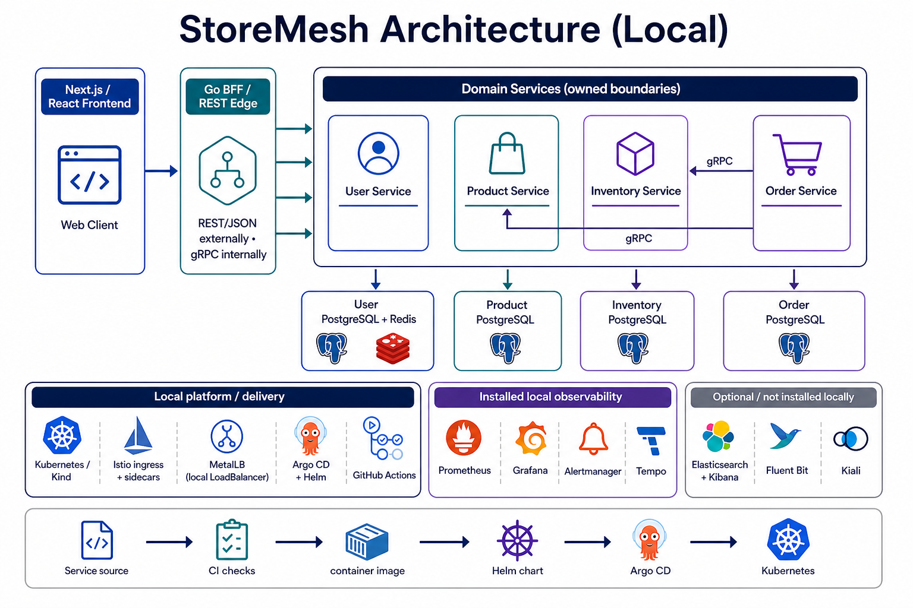

# Architecture

## Service and transport boundaries

Each StoreMesh domain service owns its business logic, persistence integration,
and public contracts. Transport handlers are adapters around one domain service
instead of separate implementations of business rules.



The diagram is an overview; the repository and roadmap pages remain the source
of truth for implementation status and deployment evidence.

| Boundary | Current approach |
| --- | --- |
| Internal APIs | gRPC |
| Direct HTTP APIs | Gin handlers owned by each service |
| Contracts | Protocol Buffers, HTTP annotations, generated OpenAPI |
| Authentication | JWT access and refresh tokens, Redis-backed sessions |
| Authorization | Persisted user roles and server-side role checks |
| Observability | Prometheus, Grafana, Alertmanager, Tempo, plus optional Elasticsearch/Kibana logging |

## Observability architecture

Observability is a platform capability rather than a responsibility duplicated
inside each domain service. Services emit structured JSON logs, Prometheus
metrics, and W3C/OTLP trace context; the platform collects and correlates those
signals:

```text
Services ── metrics ───────────────► Prometheus ─► Grafana/Alertmanager
         ── JSON logs ─► Fluent Bit ► Elasticsearch (ECK) ► Kibana
         ── OTLP traces ───────────► OpenTelemetry Collector ► Grafana Tempo
Istio ──── access metrics/traces ───► Prometheus/OTel (with Kiali as an optional view)
```

Prometheus, Grafana, and Alertmanager are the initial metrics and alerting
stack. Elasticsearch and Kibana, managed by the Elastic Cloud on Kubernetes
(ECK) operator, are the selected centralized logging path, with Fluent Bit (or
an equivalent node collector) forwarding logs and applying retention and
redaction policy. Istio is an optional service-mesh layer for
traffic policy, mTLS, access telemetry, and uniform tracing; it is not required
for the current gRPC service boundaries. OpenTelemetry Collector is preferred
as the stable ingestion boundary so the trace backend can be changed without
modifying services.

These components are installed in stages through Argo CD and remain opt-in for
the local Kind profile. Production environments must define persistent storage,
resource limits, retention, access control, and secret management before
enabling Elasticsearch or a mesh. Application `PrometheusRule` resources are
enabled only after a Prometheus Operator-compatible stack is available.

## Recommended transport architecture

StoreMesh should use protobuf and gRPC as the canonical service contract, with
REST as the client-facing representation at the edge. This gives internal
service calls strong typing, streaming support, deadlines, and consistent
status semantics without forcing web and mobile clients to speak gRPC.

The target shape is:

```text
Web / mobile / partner clients
             │ REST/JSON over HTTPS
             ▼
       Go BFF / edge API
             │ gRPC + protobuf
             ▼
 User ─── Product ─── Inventory ─── Order
```

The BFF should use generated gRPC clients and, where practical, generated
gRPC-Gateway bindings for straightforward REST-to-gRPC translation. Handwritten
BFF methods should be reserved for true composition, such as an order summary
that combines order, product, inventory, and user data. Domain services should
not each grow separate public REST implementations for the same business
operations.

During the transition, existing service-owned REST endpoints may remain for
authentication, health, readiness, metrics, and compatibility. New client
business workflows should converge on the BFF, while service-to-service
traffic remains gRPC. REST should not be used for internal orchestration unless
there is a clear external integration requirement.

This decision avoids maintaining two independent business APIs per service,
keeps composition in one edge boundary, and leaves room for GraphQL later if
measured client requirements justify it. GraphQL is not part of the initial
transport commitment.

## User service

The user service is the current reference implementation. It exposes gRPC on
port `50051` and HTTP on port `8080`. Both transports invoke the same domain
service. Its HTTP endpoints include authentication, user management, role
operations, liveness (`/healthz`), readiness (`/readyz`), and metrics
(`/metrics`).

## Platform delivery flow

```text
Service source → CI/security checks → container image → Helm chart
       → Argo CD application → Kubernetes cluster
```

Helm owns Kubernetes workload configuration. Argo CD continuously reconciles
the desired state from Git. Kind is the local, repeatable platform target.
The domain charts now apply PodDisruptionBudgets and namespace-scoped gRPC
ingress policies as the first production-hardening baseline. The policy model
keeps Product and Inventory reachable from Order while leaving future BFF or
ingress access as an explicit boundary change.

## API composition and BFF decision

API composition is expected for richer client workflows, but it is not a
requirement for every service call. A client can call a single domain service
directly when that service owns the complete use case. A composed experience
such as an order summary may eventually need Product, Inventory, Order, and
User data combined into one client-oriented response.

The implemented Go BFF is the client-facing edge for the current web
application. Its external protocol is REST, while its internal calls use the
domain services' gRPC contracts:

```text
Web/mobile client → BFF REST or GraphQL API → internal gRPC → domain services
```

REST and GraphQL are alternatives for the BFF's client-facing API, not
mandatory requirements to introduce together. GraphQL is useful when clients
need flexible, nested selection; REST is simpler when resource-oriented
endpoints and HTTP caching are sufficient. The BFF could be implemented in
Node.js/TypeScript, Go, or another supported platform; the language does not
change the boundary rules.

The BFF remains an orchestration and presentation layer and must not absorb
Product, Inventory, Order, or User business ownership. GraphQL remains a future
option only if measured client requirements justify flexible nested selection;
it is not part of the current implementation.

## Product service

The Product Service is the first commerce-domain boundary after identity. It
owns catalog identity, SKU, pricing, currency, and product lifecycle state. It
does not own inventory availability, cart state, orders, payments, or users.
Its initial protobuf contract is published in the
[`storemesh-product-service`](https://github.com/sartim/storemesh-product-service)
repository as the boundary for the upcoming catalog runtime.
The repository now includes reproducible generated gRPC, HTTP gateway, and
OpenAPI artifacts from its Buf template, plus an in-memory gRPC runtime for
contract and behavior validation. Product Service now supports a PostgreSQL
repository selected by
`DATABASE_URL` and JWT authorization when `JWT_SECRET` is configured; its
schema is tracked in `migrations/001_products.sql`.

## Inventory service

The Inventory Service owns on-hand, reserved, and available quantities plus
reservation lifecycle. Product Service remains the source of product identity;
orders will coordinate inventory operations through this service boundary.
The initial contract is published in the
[`storemesh-inventory-service`](https://github.com/sartim/storemesh-inventory-service)
repository, which now includes an in-memory runtime enforcing reservation and
oversell-prevention semantics. Its PostgreSQL schema foundation is tracked in
`migrations/001_inventory.sql`, with transactional repository operations for
adjustment, reservation, and release.
When `DATABASE_URL` is configured, the deployed runtime uses this PostgreSQL
repository rather than process-local memory, so reservations remain consistent
across replicas.

## Order service

The Order Service owns order lifecycle, customer association, line-item price
snapshots, totals, and cancellation. It coordinates Product and Inventory
through their public contracts and does not directly own catalog or stock
records. Its initial contract is published in the
[`storemesh-order-service`](https://github.com/sartim/storemesh-order-service)
repository.

The initial runtime validates line quantities, calculates immutable order
totals from price snapshots, and supports cancellation transitions.
Its PostgreSQL schema foundation is tracked in `migrations/001_orders.sql`, and
the runtime now switches to a transactional PostgreSQL repository when
`DATABASE_URL` is configured. Order creation persists the order and all line
items atomically; reads reload immutable price snapshots and cancellation is a
guarded state transition.
The service also has a distroless multi-platform container workflow and is
packaged for GitOps through the Order Service Helm chart and Argo CD
application.
The repository includes a coordination boundary for Product catalog lookups
and Inventory reservations, including release compensation when order creation
fails. Concrete gRPC adapters and runtime wiring are deployed and covered by
both in-process and Kind-based workflow verification; the boundary keeps the
integration testable without duplicating domain ownership.
Concrete gRPC adapters now consume the published Product and Inventory Go
contract modules. When `PRODUCT_SERVICE_ADDRESS` and
`INVENTORY_SERVICE_ADDRESS` are configured alongside `DATABASE_URL`, Order
Service uses the coordinated path; otherwise it retains the persistent-only
mode for compatibility and isolated development.
Create requests may include an `idempotency_key`; PostgreSQL enforces a unique
key and retries return the original order without reserving inventory again.
An in-process gRPC integration test exercises the generated Product and
Inventory clients with the coordination workflow; deployment-level tests can
reuse the same scenario against the Kind services.
Product Service enforces JWT authentication on gRPC calls. Order Service now
supports short-lived service JWTs through `PRODUCT_JWT_SECRET`, with issuer and
audience defaults matching Product Service; shared secret delivery remains an
environment/secret-manager responsibility.

## Documentation platform evolution

The current documentation site uses Jekyll and Markdown on GitHub Pages. A
future Next.js static-export site is reserved as an option for interactive
architecture views, richer search, API explorers, or versioned documentation.
It should be reconsidered after the API contracts and domain-service surface
have matured; it is not a current runtime dependency.
